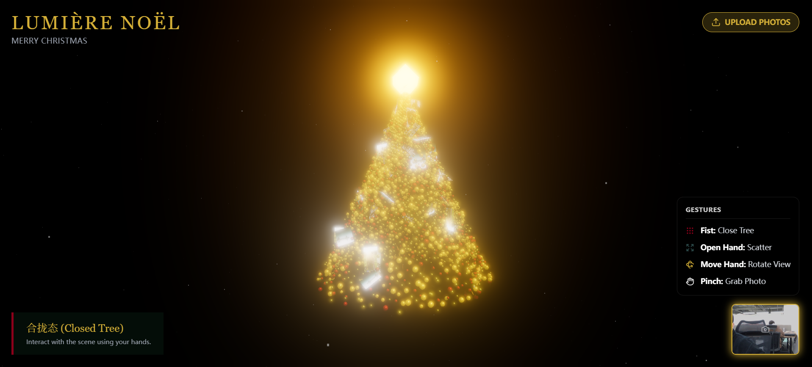
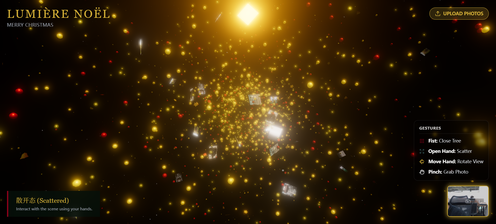
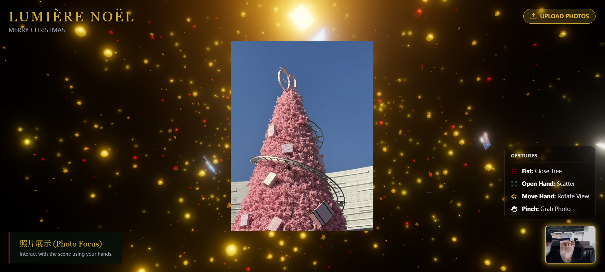

# 一个基于 **React**, **Three.js (R3F)** 和 **mediapipe 手势识别** 的3D 圣诞树

这是一个交互式的3D圣诞树应用，结合了现代Web技术和AI手势识别技术。通过摄像头捕捉用户的手势动作，用户可以控制圣诞树的形态变化，并将个人照片融入到3D场景中。

## 功能特色

- **手势控制**: 使用MediaPipe进行实时手势识别
  - 握拳 (FIST): 切换到树形模式
  - 张开手掌 (OPEN_HAND): 切换到散开模式
  - 捏手势 (PINCH): 抓取和聚焦照片
- **三种显示模式**:
  - **TREE**: 圣诞树锥形排列
  - **SCATTER**: 粒子自由浮动散开
  - **FOCUS**: 聚焦单个照片放大显示
- **3D装饰元素**: 金球、苹果、星星、铃铛等圣诞元素
- **照片上传**: 支持上传个人照片到圣诞树上
- **响应式设计**: 自适应屏幕尺寸

## 运行效果图

### 初始状态


### 张开手掌 - 散开模式


### 捏手势 - 聚焦模式



## 技术栈

- **React 19**: 前端框架
- **Three.js + React Three Fiber**: 3D渲染
- **MediaPipe Tasks Vision**: 手势识别
- **TypeScript**: 类型安全
- **Vite**: 构建工具
- **Tailwind CSS**: 样式框架

## 本地运行

**前提条件:** Node.js (推荐使用最新LTS版本)

1. **安装依赖**:
   ```bash
   npm install
   ```

2. **设置环境变量** (可选):
   如果需要使用AI Studio功能，创建 `.env.local` 文件并设置:
   ```
   GEMINI_API_KEY=your_gemini_api_key_here
   ```

3. **启动开发服务器**:
   ```bash
   npm run dev
   ```

4. **访问应用**:
   打开浏览器访问 `http://localhost:5173`

## 使用方法

1. **允许摄像头权限**: 首次运行时浏览器会请求摄像头权限，请允许以启用手势识别功能

2. **手势操作**:
   - **握拳**: 将所有元素排列成圣诞树形状
   - **张开手掌**: 让元素自由散开浮动
   - **捏手势**: 在散开模式下靠近照片可抓取并聚焦查看

3. **上传照片**:
   - 点击界面上的上传按钮
   - 选择一张或多张照片
   - 照片会自动添加到圣诞树装饰中

4. **模式切换**: 通过不同手势在树形、散开、聚焦三种模式间切换

## 构建生产版本

```bash
npm run build
npm run preview
```

## 在线预览

在AI Studio中查看应用: https://ai.studio/apps/drive/1zIEJpuIn9cmi1Hsz65nd1VJsQzeNq8Cm
